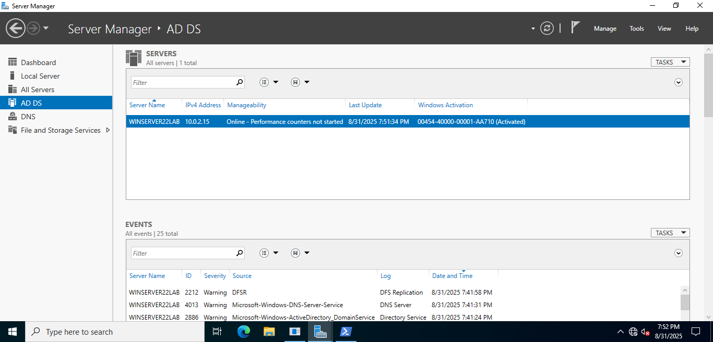
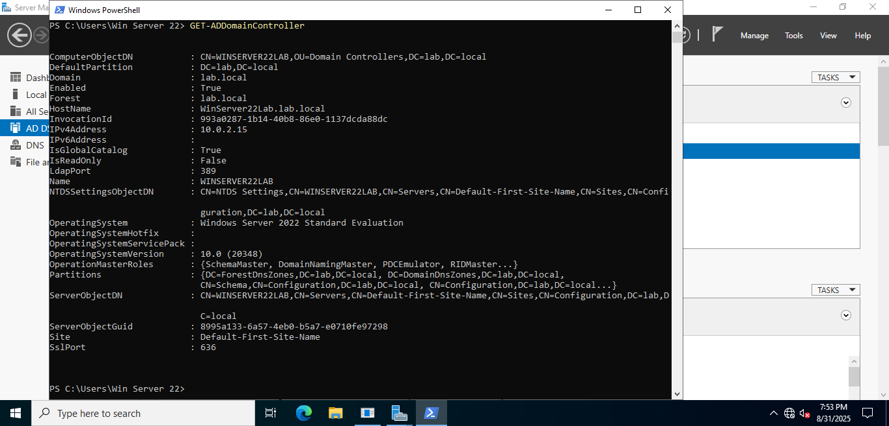

# Active Directory Domain Services Setup on Windows Server 2022

This lab documents the installation and configuration of Active Directory Domain Services (AD DS) on the Windows Server 2022 virtual machine.

---

## Server Manager Configuration

Computer name set to **WinServer22Lab**.  

  

---

## Installing Active Directory Domain Services

- Server Manager opened, selected roles  
- AD DS role selected and installed  
- Installation confirmed successful  

  
  
  
  
  

---

## Verification

- Server Manager shows AD DS role installed  
- PowerShell confirms installation  

  
  

## AD DS Domain Controller Setup Verification

The server is promoted to a domain controller and the AD DS role is confirmed.

### Server Manager

### PowerShell

