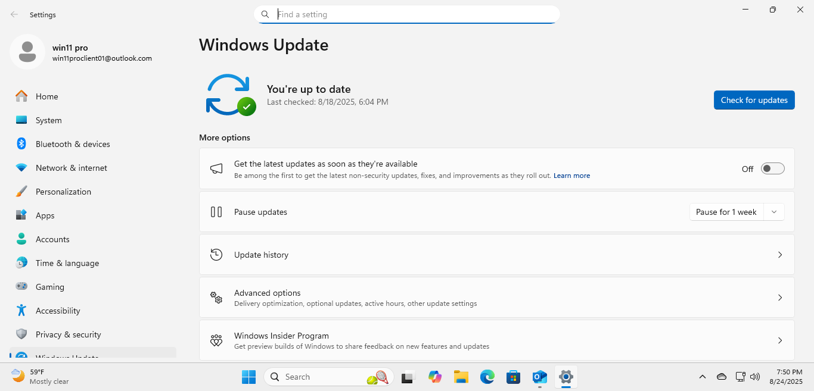
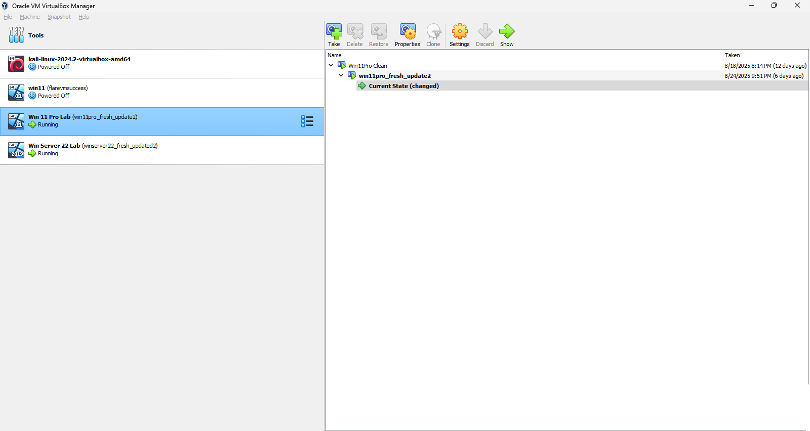
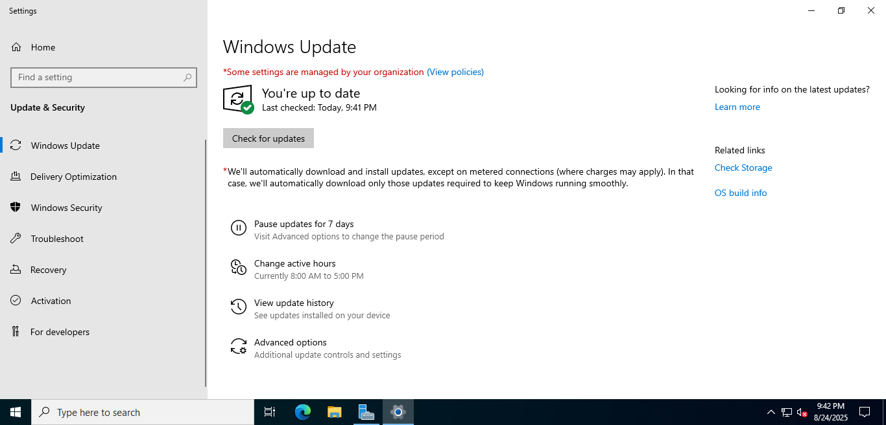
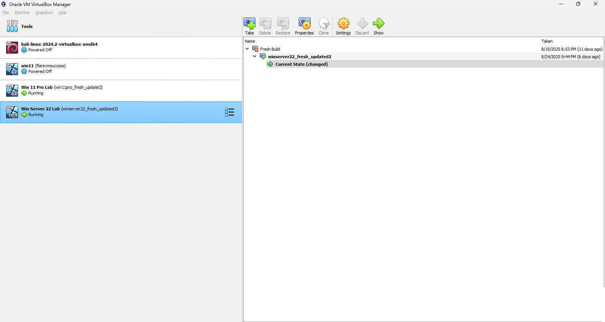

# Installing and Updating Windows 11 Pro and Windows Server 2022

This lab documents the setup of two virtual machines in Oracle VirtualBox:  
- Windows 11 Pro  
- Windows Server 2022  

Both machines were installed, updated, and had snapshots created for recovery.

---

## Windows 11 Pro Setup

- Fresh install completed  
- Windows updates installed  
- Snapshot created  

  
  

---

## Windows Server 2022 Setup

- Fresh install completed  
- Windows updates installed  
- Snapshot created  

  
  
