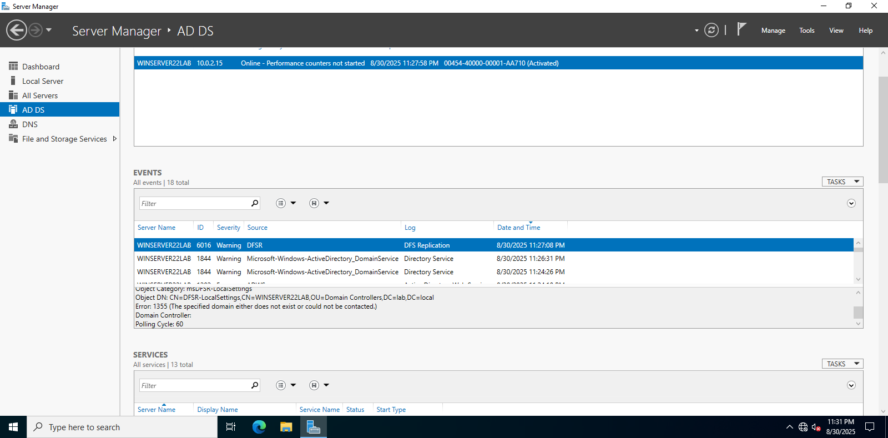
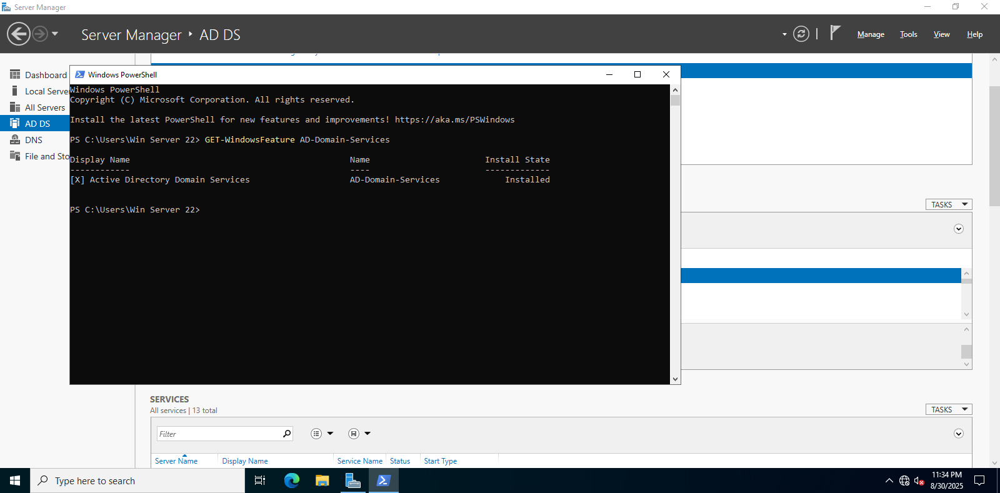
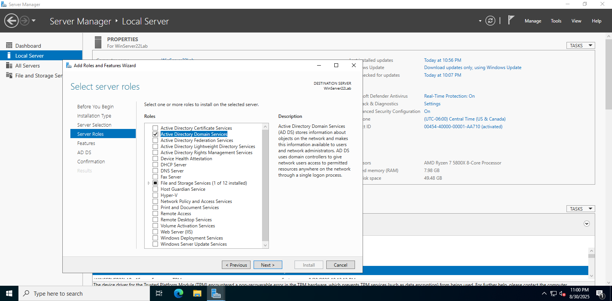
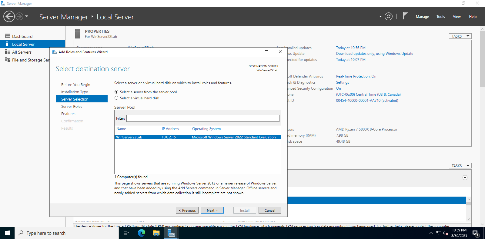
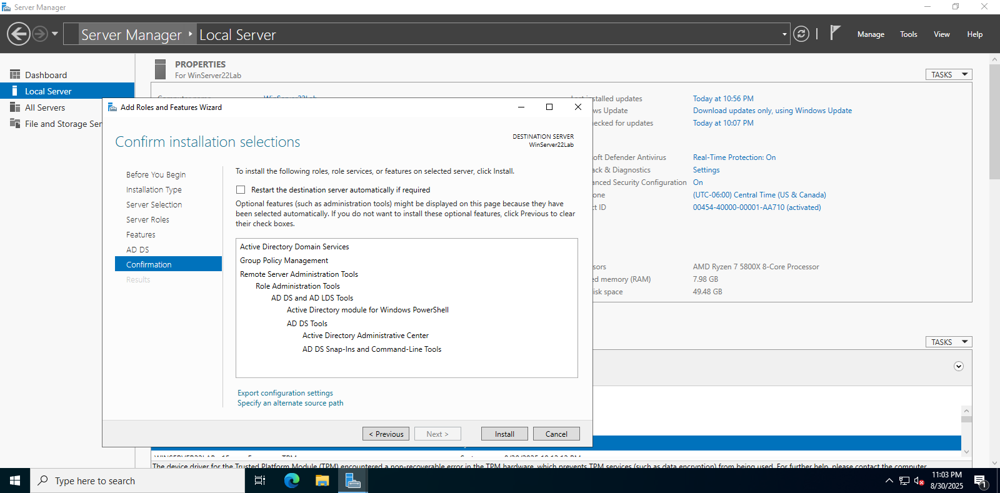
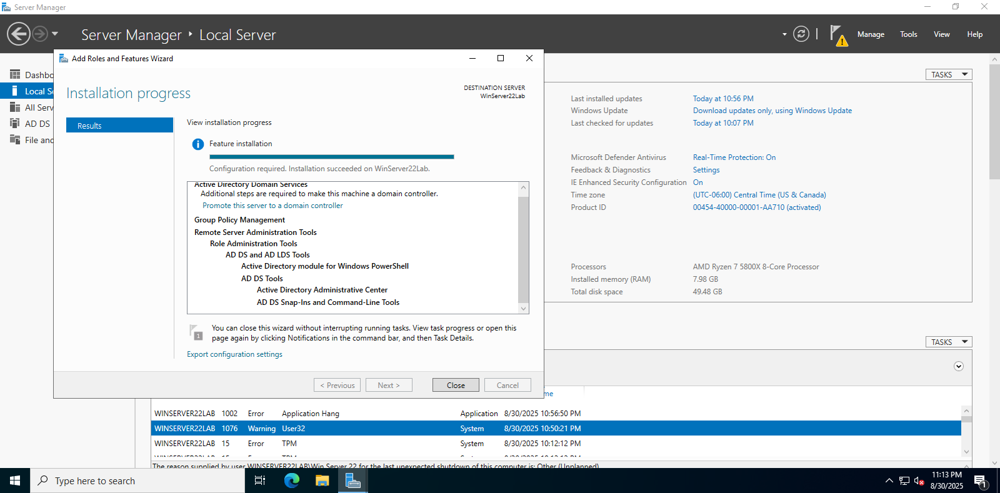

## Windows 11 Pro

- Fresh install completed
- Updates installed
- Snapshot created

---

## Windows Server 2022 – Initial Setup

- Computer name set to `WinServer22Lab`
- AD DS role installed
- Screenshots of Server Manager and PowerShell confirmation

---

## Windows Server 2022 – AD DS Installation Process

- Role installation selections and confirmations

